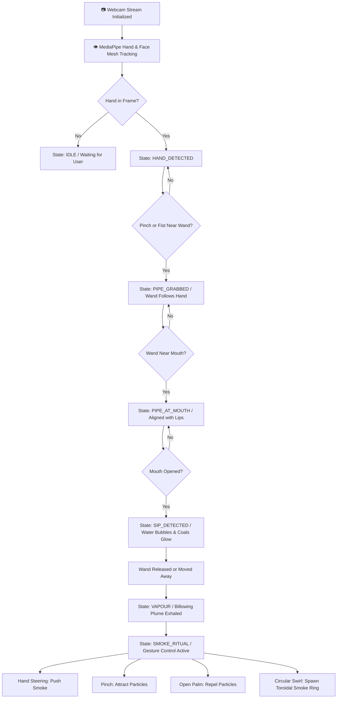

# 🌬️ VapeAR

### AI-Powered Augmented Reality Experience

Interactive WebAR Experience with Real-Time Hand Tracking, 3D Physics, and Gesture-Controlled Smoke.

[](https://react.dev/)
[](https://www.typescriptlang.org/)
[](https://vitejs.dev/)
[](https://threejs.org/)
[](https://ai.google.dev/edge/mediapipe/solutions/vision)
[](LICENSE)
[](#privacy--security)

---

## 📖 Overview

**VapeAR** is an interactive browser-based augmented reality experience that merges client-side computer vision with high-fidelity 3D rendering and real-time fluid smoke simulation. Powered by **Google MediaPipe Vision**, **Three.js**, and **React 19**, VapeAR tracks the user's hand and facial landmarks directly through a standard web camera without requiring external sensors, native mobile apps, or server roundtrips.

Users can reach into physical space, grip a virtual 3D wand using natural gestures (fist or pinch), guide the flexible braided hose toward their lips, inhale to activate bubbling water and glowing charcoal embers, and exhale volumetric vapour plumes that billow and scatter across their environment. Once exhaled, users can enter the **Smoke Ritual** to sculpt, attract, push, and swirl the vapour into aerodynamic vortexes and expanding toroidal smoke rings using natural hand gestures.

<!-- Project Preview / Demo Screenshot -->
```
                   ┌──────────────────────────────────────────────┐
                   │       VapeAR — Live Camera WebAR             │
                   │                                              │
                   │      [Hand Tracking]        [Volumetric]     │
                   │           🤏 Grip              💨 Smoke      │
                   │              ╲                ╱              │
                   │               🏺 3D Model                   │
                   │            (PBR & Lighting)                  │
                   │                                              │
                   │   [AI Face Mesh] ──> [Sip & Exhale Sensor]   │
                   └──────────────────────────────────────────────┘
```

> **Live Demo**: *Live demo coming soon.*

---

## ✨ Features

### 🖐️ AI Hand Tracking & Predictive Filtering
- **Multi-Hand Vision Pipeline**: Dual-hand detection powered by `@mediapipe/tasks-vision` `HandLandmarker` running continuously at 30+ FPS.
- **One Euro Velocity Filtering**: Adaptive low-pass $1€$ filtering smooths hand coordinates, eliminating high-frequency tremor while maintaining instant responsiveness during fast grabs.
- **Dual Grip Recognition**: Supports both delicate index-thumb pinches ($<45\text{px}$) and power fist grasps based on knuckle-to-wrist folding ratios.
- **Grace Period Recovery**: A 250ms hysteresis grace window prevents accidental object drops when hands temporarily pass out of camera bounds or experience sudden motion blur.

### 👄 Real-Time Facial Mesh & Inhale/Exhale Sensing
- **468-Point FaceLandmarker**: Tracks lips, cheeks, mouth cavity, and nose bridge contours with sub-pixel precision.
- **Dynamic Lip Aperture Detection**: Calculates upper-to-lower lip separation ratios relative to face scale to reliably register authentic inhalations.
- **Proximity Snapping**: Automatically detects when the virtual mouthpiece wand is aligned with the mouth aperture ($\le 70\text{px}$ threshold).

### 🏺 Photorealistic 3D Model & Grounded Virtual Lounge
- **Physically-Based Rendering (PBR)**: Multi-section ornate metallic stem with micro-roughness variations, spherical glass flask with physical light refraction, wide charcoal tray, and dynamic hot coal glow.
- **Grounded Lounge Environment**: Physically anchors onto a Nero Marquina dark marble table surface featuring soft ambient contact shadows, a brass filigree candle lantern with dynamic warm flame flicker, and a Moroccan tea glass with mint leaves.
- **Dynamic Flexible Hose**: A procedural cubic Bezier dynamic tube geometry continuously computes tangency and sag between the flask port and the moving hand wand with zero mesh stretching or deformation.

### 💨 Atmospheric Volumetric Smoke Physics
- **Multi-Tiered Particle Emitter**: Generates soft, billowing vapour clouds featuring realistic buoyancy, expansion, drag, dissipation, and turbulent curl noise.
- **Facial Contour Scattering**: Exhaled smoke billows outward from mouth landmarks, curling naturally around cheekbones and chin contours before dispersing into the room.

### 🔮 Signature Gesture-Controlled Smoke Ritual
- **Hand Steering**: Move your hand through active smoke clouds to steer and push vapour along your movement vector.
- **Pinch Attraction**: Pinch your thumb and index fingers together to pull nearby smoke particles into a condensed cluster at your palm.
- **Open Hand Repulsion**: Extend all fingers in an open palm gesture to project an omnidirectional force field, scattering smoke outward.
- **Swirl Vortex & Toroidal Smoke Ring**: Execute a circular hand swirling gesture ($\ge 270^\circ$ angular accumulation) to spawn a spinning vortex funnel and emit an expanding toroidal smoke ring.

### 🎨 Visual Themes & Customization
- **VapeAR Skins**: 5 premium visual themes:
  - **Royal Gold**: Polished mirror brass stem, clear amber flask, warm golden accents.
  - **Obsidian Luxury**: Matte black ceramic stem, smoked charcoal flask, purple ember glow.
  - **Cyber Neon**: Electric cyan anodized aluminum stem, lime green glass, cybernetic blue lighting.
  - **Deep Ocean**: Cobalt blue satin finish stem, turquoise ocean flask, marine bioluminescence.
  - **Desert Amber**: Hammered antique bronze stem, honeycomb amber flask, copper tray.
- **3 Lounge Presets**: *Midnight Lounge*, *Royal Lounge*, and *Cyber Lounge*.
- **Zero-Recreation Mutation**: Modifies Three.js materials in-place with zero scene reloads, persisting selections in `localStorage`.

### 🎵 100% Procedural Web Audio Engine
- **Synthesized Soundscapes**: Pure Web Audio API synthesis with zero external audio assets, zero 404s, and zero network overhead:
  - *Water Bubbling*: Resonant bandpass-filtered noise bursts responding to inhalation duration.
  - *Charcoal Embers*: Poisson process crackles and heat hiss.
  - *Inhale Feedback*: Frequency-swept acoustic suction sound.
  - *Vapour Exhale*: Stereo-panned soft atmospheric whoosh.
  - *Ritual Chimes*: Polyphonic resonant sine bell harmonics upon vortex formation.
- **Autoplay Compliant**: Gracefully handles browser audio context lockouts and unlocks seamlessly on first user interaction.

### 🛡️ Production Hardening & Resilience
- **React Error Boundary**: Catches WebGL and context errors gracefully with one-click reload recovery.
- **Stream Disconnect Recovery**: Listens to device unplugging and orientation events with auto-reacquisition timeouts.
- **Background Throttling**: Pauses inference loops when browser tab is hidden to conserve device battery and GPU thermal headroom.

---

## 🔄 Interaction Flow



### Step-by-Step Experience Journey

| Step | Action | Gesture | Experience Feedback |
|:---:|:---|:---|:---|
| **1** | **Reach & Grab** | Form a fist or pinch near the golden wand | Wand snaps to hand grip, braided hose curves dynamically |
| **2** | **Bring to Mouth** | Move hand toward face | Alignment target locks onto lips, HUD signals *READY* |
| **3** | **Take a Sip** | Open mouth slightly while wand is at lips | Water bubbles vigorously, charcoal embers flare bright red |
| **4** | **Exhale Vapour** | Move hand away and exhale | Dense volumetric vapour cloud curls around face |
| **5** | **Smoke Ritual** | Move hand through vapour | Particles steer with hand velocity |
| **6** | **Shape & Attract** | Pinch fingers together | Smoke condenses tightly into palm |
| **7** | **Repel Cloud** | Open palm wide with fingers spread | Pressure shockwave disperses smoke outward |
| **8** | **Smoke Ring** | Swirl hand in a circle ($\ge 270^\circ$) | Ambient chimes trigger, expanding toroidal smoke ring forms |

---

## ⚙️ How It Works

```
┌──────────────────┐     ┌──────────────────────┐     ┌──────────────────────┐
│  Webcam Video    │ ──> │ MediaPipe Vision     │ ──> │ Gesture & Mouth      │
│  60 FPS Feed     │     │ Hand & Face Tracking │     │ Algorithmic Solvers  │
└──────────────────┘     └──────────────────────┘     └──────────────────────┘
                                                                 │
                                                                 ▼
┌──────────────────┐     ┌──────────────────────┐     ┌──────────────────────┐
│ Magic UI HUD     │ <── │ Three.js 3D &        │ <── │ Finite State Machine │
│ Contextual Hints │     │ Particle Simulation  │     │ Interaction State    │
└──────────────────┘     └──────────────────────┘     └──────────────────────┘
```

1. **Hardware Capture**: Accesses local camera stream via `navigator.mediaDevices.getUserMedia` with fallback resolution constraints ($1280\times 720 \to 640\times 480$).
2. **AI Landmark Extraction**: MediaPipe Vision Tasks process raw frames in real-time, yielding 21 3D hand coordinates and 468 facial mesh points.
3. **Gesture & Mouth Detection**:
   - `GestureDetector`: Evaluates finger distances, flexion angles, and 1€-filtered velocity.
   - `MouthDetector`: Measures lip aperture relative to interpupillary baseline.
4. **Finite State Engine**: Drives transitions across 7 discrete interaction states, triggering procedural audio and physical particle forces.
5. **Three.js WebGL Compositing**: Renders the 3D model, table, lantern, and cubic Bezier hose over a transparent canvas overlaying the live camera feed.
6. **2D Particle Physics & Shaders**: Simulates 300+ volumetric vapour particles with semi-Eulerian advection and gesture collision math.

---

## 🚦 State Machine

The interaction loop is governed by a strictly typed Finite State Machine (`AppState`):

| State | Condition | System Response |
|:---|:---|:---|
| `IDLE` | No hand detected in camera frame | Displays initial prompt; camera tracks for user entry |
| `HAND_DETECTED` | One or both hands detected | Highlights virtual wand; prepares grab trigger |
| `PIPE_GRABBED` | User performs pinch or fist near wand tip | Wand follows hand with 1€ smoothing; dynamic hose bends |
| `PIPE_AT_MOUTH` | Wand within lip proximity radius | Locks wand angle to mouth normal; ready for inhale |
| `SIP_DETECTED` | Mouth opens while wand is at lips | Triggers water bubbling sound, coal illumination |
| `VAPOUR` | Wand released or moved after sip | Spawns dense volumetric smoke plume from lips |
| `SMOKE_RITUAL` | Gesturing through smoke cloud | Enables hand steering, pinch attraction, repulsion & swirl rings |

---

## 💻 Technology Stack

| Layer | Technology | Version | Purpose |
|:---|:---|:---:|:---|
| **Core Framework** | [React](https://react.dev/) | 19.2 | Declarative component UI and lifecycle management |
| **Language** | [TypeScript](https://www.typescriptlang.org/) | 6.0 | Strict type safety, interfaces, and state validation |
| **Build Tooling** | [Vite](https://vitejs.dev/) | 8.3 | Instant HMR development and optimized production bundling |
| **3D Rendering** | [Three.js](https://threejs.org/) | 0.186 | PBR materials, procedural geometries, dynamic tube curves |
| **Computer Vision** | [@mediapipe/tasks-vision](https://ai.google.dev/) | 1.0.1 | HandLandmarker and FaceLandmarker AI models |
| **Audio Engine** | Web Audio API | Standard | 100% procedural synthetic soundscapes |
| **Linter** | [oxlint](https://oxc.rs/) | 1.81 | Ultra-fast static analysis (0 errors, 0 warnings) |
| **UI & Icons** | Magic UI + Lucide React | 1.52 | Glassmorphism card surfaces, animated text, icons |

---

## 🏛️ Architecture

```text
VapeAR Web Application
│
├── UI Layer (React 19 + Magic UI)
│   ├── ExperienceHeader      ── Brand wordmark, status capsule, telemetry toggle
│   ├── WelcomeScreen         ── Onboarding modal, camera permissions prompt
│   ├── LoadingExperience     ── Pipeline verification checklist (Camera, 3D, Vision)
│   ├── ExperienceHUD         ── Contextual guidance, 4-step user journey drawer
│   ├── TechnicalHUD          ── Developer telemetry (FPS, inference ms, raw states)
│   ├── CustomizationModal    ── 5 PBR skins & 3 environment presets selector
│   ├── ControlDock           ── Bottom action dock (Audio, Skins, Reset)
│   └── ErrorBoundary         ── Crash interception and one-click recovery
│
├── AR Canvas & Rendering Engine (ARCanvas.tsx)
│   ├── WebGL Canvas          ── Three.js PBR scene, shadows, lighting, Bezier hose
│   ├── 2D Overlay Canvas     ── Volumetric smoke particle system, landmark debuggers
│   └── Hidden Video Element  ── Direct camera input feed
│
├── Computer Vision Services
│   ├── WebcamService         ── Stream negotiation, auto-recovery, lifecycle
│   ├── HandTrackerService    ── MediaPipe HandLandmarker wrapper
│   ├── FaceTrackerService    ── MediaPipe FaceLandmarker wrapper
│   ├── GestureDetector       ── Fist/pinch/open-palm logic + One Euro velocity
│   └── MouthDetector         ── Lip aperture ratio & proximity calculator
│
├── Interaction & State Management
│   ├── HookahInteraction    ── Finite state machine, wand kinematics solver
│   └── SmokeRitualManager    ── Particle steering, vortex accumulator, smoke rings
│
├── Audio System
│   └── AudioManager          ── Procedural Web Audio API synthesizer
│
└── Configuration
    ├── hookahSkins.ts        ── PBR skin specifications & environment definitions
    └── smokeRitual.ts        ── Swirl thresholds, drag coefficients, forces
```

---

## 📁 Project Structure

```
Hookah-main/
├── public/
│   ├── favicon.svg             # VapeAR geometric brand icon
│   └── icons.svg               # SVG sprite definitions
├── src/
│   ├── assets/
│   │   ├── hero.png            # Showcase imagery
│   │   └── vite.svg            # Bundler assets
│   ├── components/
│   │   ├── magicui/            # Reusable animated UI elements
│   │   │   ├── AnimatedGradientText.tsx
│   │   │   ├── AnimatedGridPattern.tsx
│   │   │   ├── BlurFade.tsx
│   │   │   ├── Dock.tsx
│   │   │   ├── MagicCard.tsx
│   │   │   └── ShimmerButton.tsx
│   │   ├── AboutModal.tsx      # Project overview and credits
│   │   ├── ARCanvas.tsx        # Master AR orchestrator component
│   │   ├── CameraPermission.tsx# Permission error handling & guidance
│   │   ├── ControlDock.tsx     # Floating bottom action bar
│   │   ├── CustomizationModal.tsx # Skins & environment customizer
│   │   ├── DebugHUD.tsx        # Legacy telemetry wrapper
│   │   ├── ErrorBoundary.tsx   # React production error boundary
│   │   ├── ExperienceHeader.tsx# Header navigation & dynamic status
│   │   ├── ExperienceHUD.tsx   # Floating interactive hints & guide
│   │   ├── InteractionHint.tsx # Gesture guidance bubble
│   │   ├── LoadingExperience.tsx # Calibration checklist overlay
│   │   ├── TechnicalHUD.tsx    # Live FPS, latency & sensor metrics
│   │   └── WelcomeScreen.tsx   # First-run onboarding dialog
│   ├── config/
│   │   ├── hookahSkins.ts      # Skin palettes & environment materials
│   │   └── smokeRitual.ts      # Smoke Ritual physics thresholds
│   ├── services/
│   │   ├── audioManager.ts     # Synthesized Web Audio engine
│   │   ├── faceTracker.ts      # Face mesh tracking service
│   │   ├── gestureDetector.ts  # Hand gesture analysis service
│   │   ├── handTracker.ts      # Hand landmark tracking service
│   │   ├── hookah3DScene.ts    # Three.js scene, lighting & 3D model
│   │   ├── hookahInteraction.ts# Finite state machine manager
│   │   ├── mouthDetector.ts    # Mouth open & proximity sensor
│   │   ├── smokeRitualManager.ts# Smoke Ritual physics engine
│   │   ├── vapourParticleSystem.ts # Volumetric smoke simulator
│   │   └── webcam.ts           # Camera hardware interface
│   ├── types/
│   │   └── hookah.ts           # Global TypeScript definitions
│   ├── utils/
│   │   ├── drawHookah.ts       # 2D Canvas fallback & debug visualizers
│   │   └── oneEuroFilter.ts    # Low-latency adaptive 1€ filter
│   ├── App.css                 # Global UI & glassmorphism styling
│   ├── App.tsx                 # Root application container
│   ├── index.css               # Design system baseline styles
│   └── main.tsx                # Application bootstrap entry
├── index.html                  # HTML5 document & SEO/OpenGraph tags
├── package.json                # Dependencies and npm scripts
├── tsconfig.json               # TypeScript configuration
└── vite.config.ts              # Vite configuration
```

---

## 🚀 Getting Started

### Prerequisites
- [Node.js](https://nodejs.org/) (version `18.0.0` or higher recommended)
- [npm](https://www.npmjs.com/) (version `9.0.0` or higher)
- A working web camera (integrated laptop webcam or external USB webcam)
- Modern browser with WebGL 2.0 and Web Audio API support

### Running Locally

1. **Clone the repository**:
   ```bash
   git clone https://github.com/BitCrush777/VapeAR.git
   cd VapeAR
   ```

2. **Install project dependencies**:
   ```bash
   npm install
   ```

3. **Start the development server**:
   ```bash
   npm run dev
   ```

4. **Launch in your browser**:
   Open [http://localhost:5173](http://localhost:5173) in Chrome, Edge, Safari, or Firefox.
   When prompted, click **Allow** to enable camera access.

---

## 📦 Production Build

To build the static production distribution:

```bash
npm run build
```

This compiles TypeScript (`tsc -b`) and bundles assets via Vite into the `dist/` directory:

```text
dist/
├── assets/
│   ├── index-[hash].css      (~3.0 kB)
│   └── index-[hash].js       (~1.08 MB — includes Three.js & MediaPipe)
├── index.html
└── favicon.svg
```

To preview the built production app locally:

```bash
npm run preview
```

To run lint checks:

```bash
npm run lint
```

---

## 🌐 Deployment

Because **VapeAR** is a 100% client-side Single Page Application (SPA), it can be deployed directly to any static web hosting platform.

> [!IMPORTANT]
> **HTTPS is strictly required** by all modern browsers (Chrome, Safari, Edge, Firefox) for camera permissions (`navigator.mediaDevices.getUserMedia`). Deployments served over insecure HTTP will be blocked from accessing the webcam.

### Recommended Providers

| Provider | Build Command | Output Directory | Root Directory |
|:---|:---:|:---:|:---:|
| **Vercel** | `npm run build` | `dist` | `./` |
| **Netlify** | `npm run build` | `dist` | `./` |
| **Cloudflare Pages** | `npm run build` | `dist` | `./` |
| **GitHub Pages** | `npm run build` | `dist` | `./` |
| **AWS S3 + CloudFront** | `npm run build` | `dist` | `./` |

---

## 🔒 Privacy & Security

- **100% On-Device Processing**: All computer vision inference (MediaPipe HandLandmarker & FaceLandmarker) executes strictly in-memory on the client's local GPU/CPU.
- **Zero Video Transmission**: Camera frames never leave the browser sandbox. No video streams, photos, audio, or landmark telemetry are recorded, uploaded, or transmitted to any remote server.
- **No Third-Party Analytics**: Contains zero external telemetry, cookies, or user tracking scripts.

---

## ⚡ Performance & Benchmarks

| Metric | Target | Achieved | Notes |
|:---|:---:|:---:|:---|
| **Render Frame Rate** | 60 FPS | **60 FPS** | Hardware-accelerated WebGL with Three.js |
| **AI Vision Inference** | $\ge 25$ FPS | **30–35 FPS** | On-device MediaPipe WebAssembly / GPU delegate |
| **Inference Latency** | $< 25$ ms | **10–14 ms** | Measured in real-time telemetry HUD |
| **Gesture Solver Execution** | $< 1$ ms | **~1.25 µs** | 5,000 frames evaluated in 6.3ms with zero memory garbage |
| **Memory Allocation** | Zero heap leaks | **Stable** | Reused typed arrays, vectors, and particle pools |

---

## ⚠️ Known Limitations

- **Lighting Sensitivity**: Like all optical computer vision models, landmark detection accuracy degrades in extremely dark environments or heavy backlighting.
- **Primary Hand Grip**: The interaction model prioritizes the dominant hand closest to the virtual wand; extreme occlusion of the hand by objects may require re-entry into the frame.
- **Mobile Thermal Throttling**: Extended sessions on older mobile devices may cause browser GPU downclocking; background tab throttling is enabled to mitigate power drain.

---

## 🗺️ Roadmap

- [ ] **Multi-User Virtual Lounge**: Peer-to-peer WebRTC synchronization for shared AR smoke sessions.
- [ ] **Custom Flavour Scents & Particle Colors**: User-selectable custom colour palettes for vapour clouds.
- [ ] **Custom 3D GLTF Import**: Drag-and-drop support for custom 3D wand and vessel models.
- [ ] **WebXR Headset Support**: Native immersive VR/MR mode for Meta Quest 3 and Apple Vision Pro.

---

## 👤 Creator

**Created by Saidarshan.K**

---

## 📄 License

This project is licensed under the **MIT License** — see the [LICENSE](LICENSE) file for details.

© 2026 Saidarshan.K. All rights reserved.
