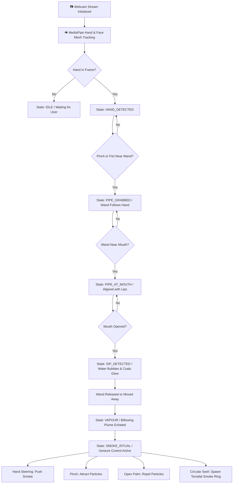
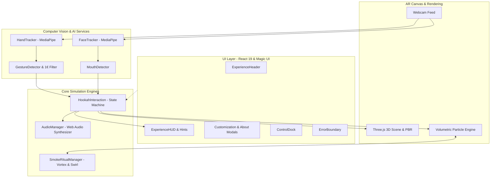

# 🌬️ VapeAR

### AI-Powered Augmented Reality Experience

Interactive WebAR Experience with Real-Time Hand Tracking, 3D Physics, and Gesture-Controlled Smoke.

[](https://react.dev/)
[](https://www.typescriptlang.org/)
[](https://vitejs.dev/)
[](https://threejs.org/)
[](https://ai.google.dev/edge/mediapipe/solutions/vision)
[](#-privacy--security)

---

## ⚡ Quick Start

```bash
# 1. Clone the repository
git clone https://github.com/BitCrush777/VapeAR.git
cd VapeAR

# 2. Install dependencies
npm install

# 3. Start local development server
npm run dev
```

Open [http://localhost:5173](http://localhost:5173) in your browser and click **Allow** when prompted for camera access.

---

## 🚀 Feature Summary

- 🖐️ **AI Hand Tracking**: Real-time 21-point 3D hand tracking with adaptive $1€$ velocity smoothing and dual-grip detection (pinch & fist).
- 👄 **Facial Mesh & Sip Detection**: 468-landmark face tracking that computes dynamic lip separation ratios and proximity alignment.
- 🏺 **Interactive 3D Hookah**: Custom procedural Three.js model featuring PBR materials, dynamic coal embers, and real-time reflections.
- ➰ **Dynamic Flexible Hose**: Procedural cubic Bezier tube geometry that dynamically recalculates tangency and drape as your hand moves.
- 💨 **Realistic Volumetric Vapour**: Multi-tiered particle simulation modeling buoyancy, drag, turbulent curl, and facial contour curling.
- 🔮 **Signature Smoke Ritual**: Hand steering, pinch particle attraction, open-palm repulsion, and circular swirl ($\ge 270^\circ$) vortex rings.
- 🎨 **Skins & Lounge Customization**: 5 visual themes (*Royal Gold*, *Obsidian Luxury*, *Cyber Neon*, *Deep Ocean*, *Desert Amber*) and 3 ambient lounge environments.
- 🎵 **100% Procedural Web Audio**: Real-time synthesized bubbling, hot coal crackles, inhale suction, and chime feedback.
- 🛡️ **Production-Hardened Client**: On-device processing, automatic camera recovery, error boundaries, and tab visibility throttling.

---

## 🖼️ Screenshots & Preview

<!-- Main AR Experience Placeholder -->
```
                   ┌──────────────────────────────────────────────┐
                   │               VapeAR Live Feed               │
                   │                                              │
                   │         [Live Hand]          [Volumetric]    │
                   │           🤏 Grip               💨 Smoke     │
                   │              ╲                 ╱             │
                   │               🏺 3D Model                    │
                   │            (PBR & Lighting)                  │
                   │                                              │
                   │   [AI Face Mesh] ───> [Lip Inhale Sensor]    │
                   └──────────────────────────────────────────────┘
```

<!-- Add project screenshot here -->
<!-- Hand interaction: Add hand grip screenshot here -->
<!-- Smoke Ritual: Add smoke swirl screenshot here -->
<!-- Customization: Add skins drawer screenshot here -->

> **Live Demo**: *Live demo coming soon.*  
> **Demo Video**: *Demo video coming soon.*

---

## 📖 Overview

**VapeAR** is an interactive browser-based augmented reality experience that merges client-side computer vision with high-fidelity 3D rendering and real-time fluid smoke simulation. Powered by **Google MediaPipe Vision**, **Three.js**, and **React 19**, VapeAR tracks the user's hand and facial landmarks directly through a standard web camera without requiring external sensors, native mobile apps, or server roundtrips.

Users can reach into physical space, grip a virtual 3D wand using natural gestures (fist or pinch), guide the flexible braided hose toward their lips, inhale to activate bubbling water and glowing charcoal embers, and exhale volumetric vapour plumes that billow and scatter across their environment. Once exhaled, users can enter the **Smoke Ritual** to sculpt, attract, push, and swirl the vapour into aerodynamic vortexes and expanding toroidal smoke rings using natural hand gestures.

All vision inference, physics calculations, graphics rendering, and audio synthesis run 100% client-side in the user's browser, ensuring immediate responsiveness and complete camera feed privacy.

---

## 🌟 Features

### 🖐️ AI Hand Tracking & Predictive Filtering
- **Multi-Hand Vision Pipeline**: Dual-hand tracking powered by `@mediapipe/tasks-vision` `HandLandmarker` running continuously at 30+ FPS.
- **One Euro Velocity Filtering**: Adaptive low-pass $1€$ filtering smooths hand coordinates, eliminating high-frequency tremor while maintaining instant responsiveness during fast grabs.
- **Dual Grip Recognition**: Supports both delicate index-thumb pinches ($<45\text{px}$) and power fist grasps based on knuckle-to-wrist folding ratios.
- **Grace Period Recovery**: A 250ms hysteresis grace window prevents accidental object drops when hands temporarily pass out of camera bounds or experience sudden motion blur.

### 👄 Real-Time Facial Mesh & Inhale/Exhale Sensing
- **468-Point FaceLandmarker**: Tracks lips, cheeks, mouth cavity, and nose bridge contours with sub-pixel precision.
- **Dynamic Lip Aperture Detection**: Calculates upper-to-lower lip separation ratios relative to face scale to reliably register authentic inhalations.
- **Proximity Snapping**: Automatically detects when the virtual mouthpiece wand is aligned with the mouth aperture ($\le 70\text{px}$ threshold).

### 🏺 Photorealistic 3D Model & Grounded Virtual Lounge
- **Physically-Based Rendering (PBR)**: Multi-section ornate metallic stem with micro-roughness variations, spherical glass flask with physical light refraction, wide charcoal tray, and dynamic hot coal glow.
- **Grounded Lounge Environment**: Physically anchors onto a Nero Marquina dark marble table surface featuring soft ambient contact shadows, a brass filigree candle lantern with dynamic warm flame flicker, and a Moroccan tea glass with mint leaves.
- **Dynamic Flexible Hose**: A procedural cubic Bezier dynamic tube geometry continuously computes tangency and sag between the flask port and the moving hand wand with zero mesh stretching or deformation.

### 💨 Atmospheric Volumetric Smoke Physics
- **Multi-Tiered Particle Emitter**: Generates soft, billowing vapour clouds featuring realistic buoyancy, expansion, drag, dissipation, and turbulent curl noise.
- **Facial Contour Scattering**: Exhaled smoke billows outward from mouth landmarks, curling naturally around cheekbones and chin contours before dispersing into the room.

### 🎨 Visual Themes & Lounge Customization
- **VapeAR Skins**: 5 premium visual themes:
  - **Royal Gold**: Polished mirror brass stem, clear amber flask, warm golden accents.
  - **Obsidian Luxury**: Matte black ceramic stem, smoked charcoal flask, purple ember glow.
  - **Cyber Neon**: Electric cyan anodized aluminum stem, lime green glass, cybernetic blue lighting.
  - **Deep Ocean**: Cobalt blue satin finish stem, turquoise ocean flask, marine bioluminescence.
  - **Desert Amber**: Hammered antique bronze stem, honeycomb amber flask, copper tray.
- **Environment Presets**:
  - **Midnight Lounge**: Deep Nero Marquina dark marble, warm lantern light, intimate atmosphere.
  - **Royal Lounge**: Calacatta gold marble, golden filigree accents, warm ambient glow.
  - **Cyber Lounge**: Brushed titanium tabletop, neon crystal lantern, futuristic cyan hue.
- **In-Place Material Mutation**: Modifies Three.js materials in real-time with zero scene reloads, persisting selections in `localStorage`.

### 🎵 100% Procedural Web Audio Engine
- **Synthesized Soundscapes**: Pure Web Audio API synthesis with zero external audio assets, zero 404s, and zero network overhead:
  - *Water Bubbling*: Resonant bandpass-filtered noise bursts responding to inhalation duration.
  - *Charcoal Embers*: Poisson process crackles and heat hiss.
  - *Inhale Feedback*: Frequency-swept acoustic suction sound.
  - *Vapour Exhale*: Stereo-panned soft atmospheric whoosh.
  - *Ritual Chimes*: Polyphonic resonant sine bell harmonics upon vortex formation.
- **Autoplay Compliant**: Gracefully handles browser audio context lockouts and unlocks seamlessly on first user interaction.

### 🛡️ Production Hardening & Resilience
- **React Error Boundary**: Catches WebGL and context errors gracefully with one-click reload recovery.
- **Stream Disconnect Recovery**: Listens to device unplugging and orientation events with auto-reacquisition timeouts.
- **Background Throttling**: Pauses inference loops when browser tab is hidden to conserve device battery and GPU thermal headroom.

### 🍂 Premium Cigar Collection & Top-Right Object Switcher
- **Zero-Latency Object Switcher**: A 34px circular icon button in the top-right control cluster allows seamless, instant toggling between the artisanal 3D Hookah and handcrafted 3D Cigar.
- **Strict Mutual Exclusion**: Guarantees only one primary object occupies the AR display area at any time with zero overlapping artifacts or dual rendering.
- **Interactive Handcrafted 3D Cigar**:
  - *Lathe-Engineered Geometry*: Authentic cylindrical barrel with gentle swell, rounded head cap, defined foot, and Spanish cedar / brass rest cradle on the marble lounge table.
  - *Procedural PBR Tobacco Textures*: 2D canvas-generated Maduro, Connecticut, and Robusto wrapper leaf veins, gold foil band ring, and cut filler tobacco ends.
  - *Natural Hand Grab Manipulation*: Pick up the cigar with hand pinch gestures, move it in 3D physical space with $1€$-filtered kinematics, and release it to gracefully settle back into its rest cradle notches.
  - *Puff & Ember Dynamics*: Bringing the cigar to your lips triggers realistic open-mouth puff detection, illuminating a pulsating red-hot ember at the foot end and billowing aromatic smoke plumes from both the lips and cigar tip.
- **Luxury Humidor & Cigar Cutter**: Interactive wooden humidor box with animated brass hinges, Spanish cedar slots, and an operable dual-blade stainless steel guillotine cutter.

---

## 🔮 Signature Feature: Smoke Ritual

The **Smoke Ritual** is a gesture-controlled interaction that activates following an exhale. The virtual smoke becomes responsive to real-time physical hand gestures:

```
                      ┌──────────────────────────────────────┐
                      │            SMOKE RITUAL              │
                      └──────────────────────────────────────┘
                                          │
         ┌─────────────────┬──────────────┴─────┬─────────────────┐
         ▼                 ▼                    ▼                 ▼
   Hand Steering    Pinch Attraction     Palm Repulsion     Swirl Vortex
   Push vapour with   Condense smoke     Disperse smoke     Form expanding
   hand trajectory    toward palm        with shockwave     toroidal ring
```

- **Hand Steering**: Moving your hand through active smoke clouds exerts aerodynamic velocity, pushing and guiding the vapour along your hand vector.
- **Pinch Attraction**: Pinching thumb and index fingers together pulls nearby smoke particles into a dense cluster centered on your palm.
- **Open Hand Repulsion**: Spreading all fingers wide in an open palm gesture produces an omnidirectional force field, scattering smoke outward.
- **Swirl Vortex & Toroidal Smoke Ring**: Circling your hand in a continuous motion ($\ge 270^\circ$ angular accumulation) spawns a rotating vortex funnel and emits an expanding toroidal smoke ring accompanied by procedural harmonic chimes.

---

## 🔄 Interaction Flow



### Step-by-Step Experience Journey

| Step | Action | Gesture | System Response |
|:---:|:---|:---|:---|
| **1** | **Reach & Grab** | Close fist or pinch fingers near wand tip | Wand snaps to hand grip, dynamic braided hose bends |
| **2** | **Bring to Mouth** | Move hand toward lips | Wand locks to mouth normal, HUD signals *READY* |
| **3** | **Take a Sip** | Open mouth slightly while wand is at lips | Water bubbles vigorously, charcoal embers flare bright red |
| **4** | **Exhale Vapour** | Move hand away and exhale | Dense volumetric vapour cloud curls around face contours |
| **5** | **Smoke Ritual** | Move hand through smoke cloud | Particles steer along hand velocity trajectory |
| **6** | **Shape & Attract** | Pinch fingers together | Smoke condenses tightly into palm |
| **7** | **Repel Cloud** | Open palm wide with fingers spread | Force field pushes and disperses smoke outward |
| **8** | **Smoke Ring** | Swirl hand in a circle ($\ge 270^\circ$) | Ambient chime sounds, expanding toroidal smoke ring forms |

---

## ⚙️ How It Works

```
┌──────────────────┐     ┌──────────────────────┐     ┌──────────────────────┐
│  Webcam Video    │ ──> │ MediaPipe Vision     │ ──> │ Gesture & Mouth      │
│  60 FPS Feed     │     │ Hand & Face Tracking │     │ Algorithmic Solvers  │
└──────────────────┘     └──────────────────────┘     └──────────────────────┘
                                                                 │
                                                                 ▼
┌──────────────────┐     ┌──────────────────────┐     ┌──────────────────────┐
│ Magic UI HUD     │ <── │ Three.js 3D &        │ <── │ Finite State Machine │
│ Contextual Hints │     │ Particle Simulation  │     │ Interaction State    │
└──────────────────┘     └──────────────────────┘     └──────────────────────┘
```

1. **Hardware Capture**: Accesses local camera stream via `navigator.mediaDevices.getUserMedia` with fallback resolution negotiation ($1280\times 720 \to 640\times 480$).
2. **AI Landmark Extraction**: MediaPipe Vision Tasks process raw frames in real-time, yielding 21 3D hand coordinates and 468 facial mesh points.
3. **Gesture & Mouth Detection**:
   - `GestureDetector`: Evaluates finger distances, flexion angles, and 1€-filtered velocity.
   - `MouthDetector`: Measures lip aperture relative to interpupillary baseline.
4. **Finite State Engine**: Drives transitions across 7 discrete interaction states, triggering procedural audio and physical particle forces.
5. **Three.js WebGL Compositing**: Renders the 3D model, table, lantern, and cubic Bezier hose over a transparent canvas overlaying the live camera feed.
6. **2D Particle Physics & Shaders**: Simulates 300+ volumetric vapour particles with semi-Eulerian advection and gesture collision math.

---

## 🚦 State Machine

The interaction loop is governed by a strictly typed Finite State Machine (`AppState`):

| State | Condition | Meaning & System Response |
|:---|:---|:---|
| `IDLE` | No hand detected in camera frame | Initial resting state; displays prompt and waits for user entry |
| `HAND_DETECTED` | One or both hands detected in frame | Visual target highlights wand tip; prepares grab detection |
| `PIPE_GRABBED` | User performs pinch or fist near wand tip | Wand follows hand with 1€ smoothing; dynamic hose bends |
| `PIPE_AT_MOUTH` | Wand within lip proximity radius | Locks wand angle to mouth normal; ready for inhale |
| `SIP_DETECTED` | Mouth opens while wand is at lips | Triggers water bubbling sound, coal illumination |
| `VAPOUR` | Wand released or moved after sip | Spawns dense volumetric smoke plume from lips |
| `SMOKE_RITUAL` | Gesturing through smoke cloud | Enables hand steering, pinch attraction, repulsion & swirl rings |

---

## 💻 Technology Stack

| Technology | Version | Purpose |
|:---|:---:|:---|
| [React](https://react.dev/) | 19.2 | Declarative component UI and application orchestration |
| [TypeScript](https://www.typescriptlang.org/) | 6.0 | Strict type safety, interfaces, and state validation |
| [Vite](https://vitejs.dev/) | 8.3 | High-performance dev server and production bundling |
| [Three.js](https://threejs.org/) | 0.186 | 3D rendering, PBR materials, dynamic tube geometries |
| [@mediapipe/tasks-vision](https://ai.google.dev/) | 1.0.1 | Client-side HandLandmarker and FaceLandmarker AI models |
| Canvas 2D | Standard | Volumetric smoke rendering, turbulent curl physics, debug overlays |
| Web Audio API | Standard | 100% procedural synthetic soundscapes (no audio files) |
| [oxlint](https://oxc.rs/) | 1.81 | Static analysis and linting (0 errors, 0 warnings) |
| Magic UI + Lucide React | 1.52 | Glassmorphism surfaces, animated text, accessible icons |

---

## 🏛️ Architecture



```text
React Application
│
├── UI Layer
│   ├── ExperienceHeader      ── Brand wordmark, status capsule, telemetry toggle
│   ├── WelcomeScreen         ── Onboarding modal, camera permissions prompt
│   ├── LoadingExperience     ── Pipeline verification checklist (Camera, 3D, Vision)
│   ├── ExperienceHUD         ── Contextual guidance, 4-step user journey drawer
│   ├── TechnicalHUD          ── Developer telemetry (FPS, inference ms, raw states)
│   ├── CustomizationModal    ── 5 PBR skins & 3 environment presets selector
│   ├── ControlDock           ── Bottom action dock (Audio, Skins, Reset)
│   └── ErrorBoundary         ── Crash interception and one-click recovery
│
├── AR Canvas & Rendering
│   ├── WebGL Canvas          ── Three.js PBR scene, shadows, lighting, Bezier hose
│   ├── 2D Overlay Canvas     ── Volumetric smoke particle system, landmark debuggers
│   └── Hidden Video Element  ── Direct camera input feed
│
├── Computer Vision Services
│   ├── WebcamService         ── Stream negotiation, auto-recovery, lifecycle
│   ├── HandTrackerService    ── MediaPipe HandLandmarker wrapper
│   ├── FaceTrackerService    ── MediaPipe FaceLandmarker wrapper
│   ├── GestureDetector       ── Fist/pinch/open-palm logic + One Euro velocity
│   └── MouthDetector         ── Lip aperture ratio & proximity calculator
│
├── Interaction & State Management
│   ├── HookahInteraction    ── Finite state machine, wand kinematics solver
│   └── SmokeRitualManager    ── Particle steering, vortex accumulator, smoke rings
│
├── Audio System
│   └── AudioManager          ── Procedural Web Audio API synthesizer
│
└── Configuration
    ├── hookahSkins.ts        ── PBR skin specifications & environment definitions
    └── smokeRitual.ts        ── Swirl thresholds, drag coefficients, forces
```

---

## 📁 Project Structure

```
Hookah-main/
├── public/
│   ├── favicon.svg             # VapeAR geometric brand icon
│   └── icons.svg               # SVG sprite definitions
├── src/
│   ├── assets/
│   │   ├── hero.png            # Project preview asset
│   │   ├── react.svg           # Framework icon
│   │   └── vite.svg            # Bundler icon
│   ├── components/
│   │   ├── magicui/            # Reusable animated UI components
│   │   │   ├── AnimatedGradientText.tsx
│   │   │   ├── AnimatedGridPattern.tsx
│   │   │   ├── BlurFade.tsx
│   │   │   ├── Dock.tsx
│   │   │   ├── MagicCard.tsx
│   │   │   └── ShimmerButton.tsx
│   │   ├── AboutModal.tsx      # Project overview and author credits
│   │   ├── ARCanvas.tsx        # Master WebAR orchestrator component
│   │   ├── CameraPermission.tsx# Camera error handling & recovery card
│   │   ├── CigarCollectionPanel.tsx # Luxury cigar collection drawer
│   │   ├── ControlDock.tsx     # Bottom floating action dock
│   │   ├── CustomizationModal.tsx # Skins & environment customizer
│   │   ├── DebugHUD.tsx        # Legacy telemetry wrapper
│   │   ├── ErrorBoundary.tsx   # React production error boundary
│   │   ├── ExperienceHeader.tsx# Header navigation, status capsule & object switcher
│   │   ├── ExperienceHUD.tsx   # Floating interactive hints & guide
│   │   ├── InteractionHint.tsx # Gesture guidance bubble
│   │   ├── LoadingExperience.tsx # Calibration checklist overlay
│   │   ├── TechnicalHUD.tsx    # Live FPS, latency & sensor metrics
│   │   └── WelcomeScreen.tsx   # First-run onboarding dialog
│   ├── config/
│   │   ├── hookahSkins.ts      # Skin palettes & environment materials
│   │   └── smokeRitual.ts      # Smoke Ritual physics thresholds
│   ├── services/
│   │   ├── cigarCollection/    # Handcrafted 3D cigar, box & cutter factories
│   │   │   ├── CigarBoxFactory.ts
│   │   │   ├── CigarCollectionManager.ts
│   │   │   ├── CigarCutterFactory.ts
│   │   │   ├── CigarFactory.ts
│   │   │   ├── cigarMaterials.ts
│   │   │   └── cigarVariants.ts
│   │   ├── audioManager.ts     # Synthesized Web Audio engine
│   │   ├── faceTracker.ts      # Face mesh tracking service
│   │   ├── gestureDetector.ts  # Hand gesture analysis service
│   │   ├── handTracker.ts      # Hand landmark tracking service
│   │   ├── hookah3DScene.ts    # Three.js scene, lighting, hookah & primary cigar
│   │   ├── hookahInteraction.ts# Finite state machine manager
│   │   ├── mouthDetector.ts    # Mouth open & proximity sensor
│   │   ├── smokeRitualManager.ts# Smoke Ritual physics engine
│   │   ├── vapourParticleSystem.ts # Volumetric smoke simulator
│   │   └── webcam.ts           # Camera hardware interface
│   ├── types/
│   │   └── hookah.ts           # Global TypeScript definitions (AppState, ActiveObject)
│   ├── utils/
│   │   ├── drawHookah.ts       # 2D Canvas fallback & debug visualizers
│   │   └── oneEuroFilter.ts    # Low-latency adaptive 1€ filter
│   ├── App.css                 # Global UI & glassmorphism styling
│   ├── App.tsx                 # Root application container & object switcher state
│   ├── index.css               # Design system baseline styles
│   └── main.tsx                # Application bootstrap entry
├── index.html                  # HTML5 document & SEO/OpenGraph tags
├── package.json                # Dependencies and npm scripts
├── tsconfig.json               # TypeScript configuration
└── vite.config.ts              # Vite configuration
```

---

## 📋 File Responsibility Table

| File | Primary Responsibility |
|:---|:---|
| `ARCanvas.tsx` | Core AR pipeline coordinator synchronizing camera video, WebGL 3D, particle overlay, and interaction states |
| `App.tsx` | Top-level React container managing modal visibility, theme state, audio toggles, and object switcher state |
| `ExperienceHeader.tsx` | Cinematic header with live status capsule, audio indicator, and top-right Hookah/Cigar object switcher |
| `CigarCollectionPanel.tsx` | Glassmorphic drawer for inspecting cigar variants, opening the humidor box, and testing the cigar cutter |
| `CigarCollectionManager.ts` | Orchestrates 3D cigar collection assembly, interactive hand-tracking ownership, and variant textures |
| `CigarFactory.ts` | Procedural lathe geometry constructor for realistic cigars (head cap cut, body swell, foot bevel, gold band) |
| `handTracker.ts` | MediaPipe `HandLandmarker` service providing 21 3D coordinates per hand with GPU/CPU delegate fallbacks |
| `faceTracker.ts` | MediaPipe `FaceLandmarker` service delivering 468 facial mesh landmarks for lip geometry |
| `gestureDetector.ts` | Evaluates landmarks to identify pinch closures, fist grasps, open palms, and $1€$-filtered velocities |
| `mouthDetector.ts` | Analyzes lip distance ratios relative to face scale to detect genuine open-mouth inhalations |
| `hookahInteraction.ts` | Governs the finite state machine (`AppState`), wand kinematics, grab tolerances, and mouth alignment |
| `hookah3DScene.ts` | Three.js scene manager implementing PBR materials, contact shadows, hookah, and primary cigar cradle |
| `vapourParticleSystem.ts` | Multi-tiered 2D canvas particle system computing volumetric billow physics, turbulence, buoyancy, and face curl |
| `smokeRitualManager.ts` | Signature gesture-driven engine tracking circular hand angular velocity, vortex funnels, and smoke rings |
| `audioManager.ts` | 100% procedural Web Audio API synthesizer generating bubbling water, hot coal crackles, inhale wind, and chimes |
| `hookahSkins.ts` | Material configuration presets for 5 visual skins (*Royal Gold*, *Obsidian*, *Cyber*, *Ocean*, *Desert*) and 3 lounges |
| `smokeRitual.ts` | Physics constants (swirl threshold $\ge 270^\circ$, attraction/repulsion forces, particle decay) |
| `oneEuroFilter.ts` | Adaptive low-pass $1€$ filtering algorithm balancing high-speed responsiveness with low-jitter precision |
| `drawHookah.ts` | Canvas 2D fallback rendering routines and landmark visualizers |
| `ErrorBoundary.tsx` | Production error boundary intercepting rendering/context crashes with reload recovery |

---

## 🛠️ Installation & Setup

### Prerequisites
- [Node.js](https://nodejs.org/) (`v18.0.0` or higher recommended)
- [npm](https://www.npmjs.com/) (`v9.0.0` or higher)
- A working web camera (integrated laptop webcam or external USB webcam)
- Modern browser with WebGL 2.0 and Web Audio API support

### Running Locally

```bash
# 1. Clone the repository
git clone https://github.com/BitCrush777/VapeAR.git
cd VapeAR

# 2. Install dependencies
npm install

# 3. Start local development server
npm run dev
```

The Vite dev server will launch at:
```
http://localhost:5173
```
Open this address in your browser and click **Allow** when prompted for camera access.

### Production Build

To build the static production distribution:

```bash
npm run build
```

This compiles TypeScript (`tsc -b`) and bundles assets via Vite into the `dist/` directory.

To preview the production bundle locally:

```bash
npm run preview
```

### Linting

To run static analysis using the configured oxlint linter:

```bash
npm run lint
```

---

## 📷 Browser & Camera Requirements

- **Camera Hardware**: A working webcam is required for hand and face tracking.
- **Camera Permissions**: The browser will display a permission prompt upon launching. Camera access must be granted for computer vision to function.
- **HTTPS Requirement**: Modern browsers (Chrome, Safari, Edge, Firefox) enforce strict security policies:
  - `http://localhost` is permitted for local development.
  - **HTTPS is strictly required** for all remote production deployments. Non-HTTPS origins will automatically block the webcam stream.
- **Browser Compatibility**: Best experienced on Chromium-based browsers (Chrome, Edge, Brave) and Safari 16+. Performance and WebGL capabilities may vary across devices.

---

## 🌐 MediaPipe Model Dependencies

VapeAR loads Google MediaPipe Vision Task models and WebAssembly binaries dynamically at runtime via Google and jsDelivr CDNs:
- **HandLandmarker Task Model**: Downloaded from `storage.googleapis.com/mediapipe-models`.
- **WASM Binaries**: Loaded from `cdn.jsdelivr.net/npm/@mediapipe/tasks-vision`.

> [!NOTE]
> An active internet connection is required during initial application launch to download the Vision Task models and WASM binaries into browser cache. Once cached, subsequent launches load faster.

---

## 🔒 Privacy & Security

- **100% On-Device Processing**: All computer vision inference (MediaPipe HandLandmarker & FaceLandmarker) executes strictly in-memory on your local device.
- **Zero Video Transmission**: Camera frames never leave your browser sandbox. No video streams, photos, audio recordings, or biometric landmark data are saved, uploaded, or transmitted to any server.
- **No Third-Party Analytics**: Contains zero external telemetry, cookies, or user tracking scripts.

---

## ⚡ Performance & Resource Considerations

- **Computationally Intensive**: Real-time computer vision and WebGL 3D rendering are computationally demanding. Devices with dedicated GPUs or hardware WebGL acceleration will achieve higher frame rates.
- **Frame Rate Dynamics**: On desktop hardware with hardware acceleration, VapeAR targets 60 FPS rendering and 30+ FPS vision inference.
- **Mobile Hardware Considerations**: Mobile devices may experience reduced frame rates or thermal throttling during extended sessions. VapeAR automatically throttles inference loops when the browser tab is hidden to preserve battery and thermal headroom.

---

## 🚀 Deployment

Because **VapeAR** is a 100% client-side Single Page Application (SPA), it can be deployed to any modern static hosting service with HTTPS support.

### Generic Static Deployment
- **Framework Preset**: Vite
- **Build Command**: `npm run build`
- **Output Directory**: `dist`
- **Node Version**: `18.x` or `20.x`

### Vercel
1. Import the repository in Vercel.
2. Select the **Vite** framework preset.
3. Build Command: `npm run build`
4. Output Directory: `dist`
5. Deploy.

### Netlify
1. Connect repository to Netlify.
2. Build command: `npm run build`
3. Publish directory: `dist`
4. Deploy site.

### GitHub Pages
If deploying to GitHub Pages under a repository subpath (e.g. `https://<user>.github.io/<repo>/`), configure the `base` field in `vite.config.ts`:
```ts
// vite.config.ts
export default defineConfig({
  base: '/VapeAR/', // or './' for relative paths
  // ...
});
```

---

## ⚠️ Known Limitations

- **Lighting Dependencies**: As with optical computer vision systems, hand and face tracking accuracy depends on adequate, even lighting. Dim environments or harsh backlighting can degrade tracking confidence.
- **Primary Hand Priority**: The interaction engine tracks the primary hand closest to the virtual wand; severe occlusion may require moving the hand back into clear view.
- **Network Required for First Load**: Remote MediaPipe models and WASM files require internet connectivity on the first session.
- **Mobile Thermal Throttling**: Extended continuous sessions on older smartphones may lead to GPU downclocking.

---

## 🗺️ Roadmap

The following ideas represent potential future enhancements (not currently implemented):

- [ ] **Multi-User Synchronized Lounge**: Peer-to-peer WebRTC synchronization for shared virtual smoke sessions.
- [ ] **Custom Particle Color Palettes**: User-selectable custom colour themes for exhaled vapour clouds.
- [ ] **Custom 3D Model Import**: Support for importing custom 3D wand and vessel GLTF assets.
- [ ] **WebXR Headset Mode**: Native immersive spatial mode for Meta Quest and Apple Vision Pro.
- [ ] **Advanced Environmental Occlusion**: Dynamic real-world depth occlusion using WebXR Depth APIs.

---

## 🤝 Contributing

Contributions, feedback, and bug reports are welcome!

1. **Fork the repository** on GitHub.
2. **Create a feature branch**:
   ```bash
   git checkout -b feature/amazing-feature
   ```
3. **Install dependencies and make changes**:
   ```bash
   npm install
   npm run dev
   ```
4. **Test and verify**:
   ```bash
   npm run build
   npm run lint
   ```
5. **Commit your changes**:
   ```bash
   git commit -m "feat: add amazing feature"
   ```
6. **Push to your branch and open a Pull Request**.

---

## 👤 Creator

**Created by Saidarshan.K**

---

## 📄 License

This repository is distributed under open-source MIT terms for personal, educational, and developer use.

© 2026 Saidarshan.K. All rights reserved.
